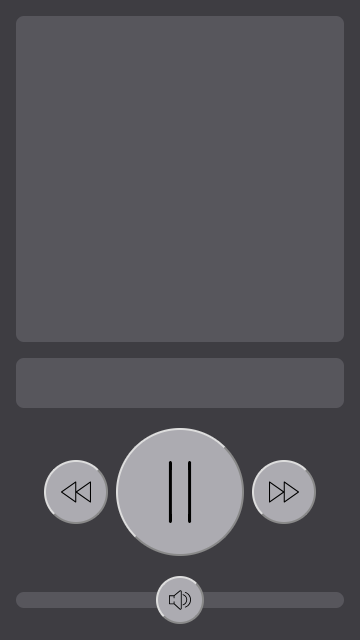

<h1 align="center">
  
  Movie Remote Control
</h1>

<p align="center">
  Watch movies using your phone as a remote control
</p>

<p align="center">
  <a href="https://circleci.com/gh/n4bb12/workflows/movie-remote-control">
    
  </a>
  <!-- <a href="https://lgtm.com/projects/g/n4bb12/movie-remote-control/alerts">
    
  </a> -->
  <!-- <a href="https://david-dm.org/n4bb12/movie-remote-control">
    
  </a> -->
  <a href="https://raw.githubusercontent.com/n4bb12/movie-remote-control/master/LICENSE">
    
  </a>
  <!-- <a href="https://hub.docker.com/r/n4bb1/movie-remote-control">
    
  </a> -->
  <!-- <a href="https://app.netlify.com/sites/movie-remote-control/deploys">
    
  </a> -->
  <a href="https://github.com/n4bb12/movie-remote-control/issues/new">
    
  </a>
</p>

<hr>

**Early development, please don't use.**

<hr>

<!-- ## Run with Docker

Quickly test it out:

```text
docker run \
  --name movie-remote-control \
  --publish 8080:80 \
  --interactive \
  --tty \
  --rm \
  n4bb1/movie-remote-control:0.0.0-1
```

Autostart it:

```text
docker run \
  --name movie-remote-control \
  --publish 8080:80 \
  --interactive \
  --tty \
  --detach \
  --restart unless-stopped \
  n4bb1/movie-remote-control:0.0.0-1
``` -->

<!-- ## Run with Node.js -->

#

Logo made by <a href="http://www.freepik.com" title="Freepik">Freepik</a> from <a href="https://www.flaticon.com/free-icon/television_421829" title="Flaticon">www.flaticon.com</a> is licensed by <a href="http://creativecommons.org/licenses/by/3.0/" title="Creative Commons BY 3.0" target="_blank">CC 3.0 BY</a><br>
Icons made by <a href="https://www.flaticon.com/authors/smashicons" title="Smashicons">Smashicons</a> from <a href="https://www.flaticon.com/packs/essential-set-2" title="Flaticon">www.flaticon.com</a> is licensed by <a href="http://creativecommons.org/licenses/by/3.0/" title="Creative Commons BY 3.0" target="_blank">CC 3.0 BY</a>
