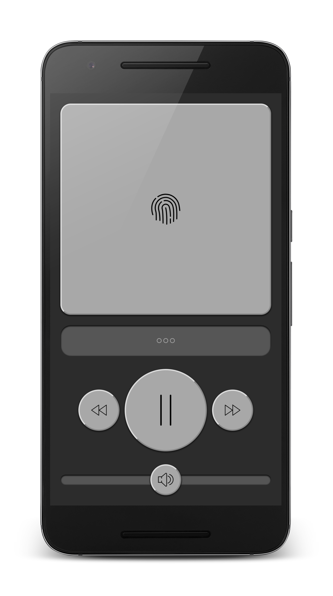
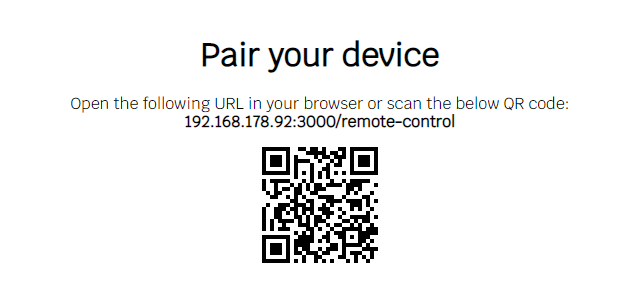

<h1 align="center">
  
  Movie Remote Control
</h1>

<p align="center">
  Watch movies using your phone as a remote control
</p>

<p align="center">
  <a href="https://www.npmjs.com/package/@n4bb12/config-tslint">
    
  </a>
  <a href="https://raw.githubusercontent.com/n4bb12/config-tslint/master/LICENSE">
    
  </a>
  <a href="https://github.com/n4bb12/movie-remote-control/issues/new">
    
  </a>
  <a href="https://david-dm.org/n4bb12/movie-remote-control">
    
  </a>
  <a href="https://circleci.com/gh/n4bb12/workflows/movie-remote-control">
    
  </a>
</p>



## Features

| What                      | Effect                          | Notes                                                                                                                              |
| ------------------------- | ------------------------------- | ---------------------------------------------------------------------------------------------------------------------------------- |
| 👈&nbsp;Tap               | <i>Click</i>                    |                                                                                                                                    |
| 💨&nbsp;Pan               | <i>Mousemove</i>                | To accomodate for larger movie screens the movement distance is doubled.                                                           |
| #️⃣&nbsp;Keyboard         | <i>Keypress</i>                 | Tap on the input field to open the keyboard, type anything.                                                                        |
| ⏪&nbsp;Rewind             | <kbd>←</kbd> + <kbd>Enter</kbd> | Some video players require pressing enter to confirm.                                                                              |
| 🆗&nbsp;Pause             | <kbd>Spacebar</kbd>             |                                                                                                                                    |
| ⏩&nbsp;Fast&#8209;forward | <kbd>→</kbd> + <kbd>Enter</kbd> |                                                                                                                                    |
| 🔉&nbsp;Volume            | <kbd>↑</kbd> \| <kbd>↓</kbd>    | Drag left or right. Volume events are throttled, so you can keep the knob attached to your finger, until the volume is satisfying. |

## Usage

#### Install

```sh
$ npm install --global movie-remote-control
```

This adds the shell the commands `mrc` or `movie-remote-control`.

#### Start Server

Start the server and open the pairing page:

```sh
$ movie-remote-control --port 3000 --open
```

#### Pair Your Device

Either scan the displayed bar code or manually open the highlighted URL on your mobile phone.

<p align="center">
  
</p>

#

Logo made by <a href="http://www.freepik.com" title="Freepik">Freepik</a> from <a href="https://www.flaticon.com/free-icon/television_421829" title="Flaticon">www.flaticon.com</a> is licensed by <a href="http://creativecommons.org/licenses/by/3.0/" title="Creative Commons BY 3.0" target="_blank">CC 3.0 BY</a><br>
Icons made by <a href="https://www.flaticon.com/authors/smashicons" title="Smashicons">Smashicons</a> from <a href="https://www.flaticon.com/packs/essential-set-2" title="Flaticon">www.flaticon.com</a> is licensed by <a href="http://creativecommons.org/licenses/by/3.0/" title="Creative Commons BY 3.0" target="_blank">CC 3.0 BY</a>
